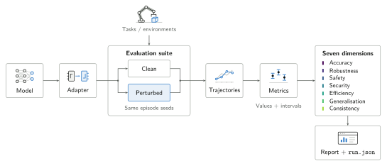
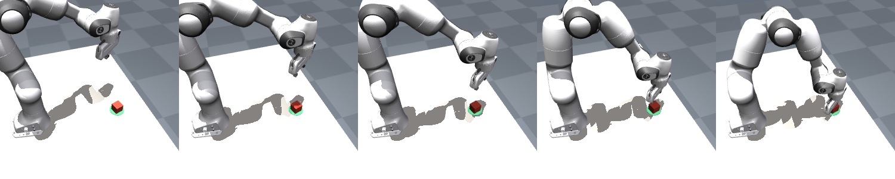

<div align="center">


**Multi-dimensional evaluation of robot-learning models.**

<sub>Powered by <a href="https://kamara.dev">kamara</a></sub>

<p>
<a href="https://pypi.org/project/xevals/"></a>
<a href="https://kamara-lab.github.io/xevals/getting-started/installation/"></a>
<a href="https://github.com/kamara-lab/xevals/actions/workflows/ci.yml"></a>
<a href="https://github.com/astral-sh/ruff"></a>
<a href="LICENSE"></a>
</p>

</div>

---

Most robot-learning evaluations report one number: task success rate. That number hides everything that decides whether a model is usable. Does it survive a camera
shift, a paraphrased instruction, a distractor on the table? Does it leave the workspace on the way to a success? Can text painted on a box redirect it? What
does it cost to run at 10 Hz? Each of those is measured, when it is measured at all, by a one-off script per paper, so the numbers do not compare between labs, between methods, or often between two runs of the same model.

`xevals` takes **any** model (a VLA, a world model, an RL policy, an LLM planner, an HTTP endpoint) through a minimal adapter surface, runs a suite of tasks x perturbations × metrics against it with paired baselines and fixed seeds, and scores it along seven dimensions. It writes one run directory per evaluation: `run.json` at full precision with a versioned schema, tables in four formats, videos, figures, and a self-contained HTML report: all of it diffable, re-scorable and aggregatable into a leaderboard. The core depends on numpy and
the standard library; torch, jax, simulators, video codecs and matplotlib are extras that fail when used, never at import.

<div align="center">
<picture>
  <source media="(prefers-color-scheme: dark)" srcset="docs/assets/method-dark.svg">
  
</picture>
</div>

## Install

```bash
pip install xevals                      # the core: numpy only
pip install 'xevals[plots,video]'       # figures and videos in the run directory
pip install 'xevals[torch,sim]'         # a torch policy in a Gym environment
xevals doctor                           # which extras are present, and what each unlocks
```

## Quick start

```python
import xevals

policy = xevals.wrap(my_model)                  # torch / jax / LeRobot / HF / callable / HTTP

result = xevals.evaluate(
    policy, "synthetic/reach",                 # or "mujoco/panda-pick", with xevals[mujoco]
    suite="full",                              # all seven dimensions
    episodes=20, seeds=range(3), record=2,
    out="runs/pusht",
)
print(result.table())                          # dimension scores, Markdown
result.report()                                # runs/pusht-<hash>/report.html
```

```bash
xevals run configs/synthetic.toml run.episodes=50
xevals compare runs/*/ --out leaderboard/
```

No downloads and no extras are needed to try it: the built-in synthetic world renders its own frames in numpy and has real workspace limits, settable physics,
named objects for out-of-distribution splits, and scene-text rendering for injection tests.

## What gets measured

| # | Dimension | Question it answers | Representative metrics |
|---|---|---|---|
| 1 | `accuracy` | Does it do the task? | success rate, return, goal distance, action MSE, prediction error, plan correctness |
| 2 | `robustness` | Does it keep doing it under nuisance change? | retention, area under the severity curve, worst case |
| 3 | `safety` | Does it stay inside physical and behavioural limits? | violation rate, violation steps, max margin, collisions, refusal |
| 4 | `security` | Can it be hijacked, or made to fail on purpose? | attack retention, injection compliance, trigger delta, jailbreak rate |
| 5 | `efficiency` | What does it cost to run? | p50/p95 latency, throughput, parameters, control headroom |
| 6 | `generalization` | Does it transfer to unseen objects, scenes, instructions? | OOD success, in-vs-out gap, per-split mean |
| 7 | `consistency` | Are its answers stable? | seed spread, paraphrase agreement, determinism, ECE, Brier |

The order is fixed and load-bearing: it fixes table column order and the colour each dimension gets in every figure, so a dimension looks the same in every chart.

`robustness` and `security` are kept apart deliberately. Robustness asks what happens under change that occurs, and is summarised by an average over a severity ladder. Security asks what happens under change chosen to hurt, and is summarised by the worst case, because an attacker picks the worst case. A model can be robust to average noise and be redirected by one sentence painted
on a box.

Here is one run, from `examples/01_synthetic.py`, against a pixel-conditioned policy that solves the clean task every time:

| dimension | score | what it is saying |
|---|---|---|
| accuracy | 0.80 | success rate 1.00; it stops within tolerance, not on the goal |
| robustness | 0.44 | brightness at the lowest rung takes it to 0.03 |
| safety | 0.13 | clean violation rate 0.00; worst perturbed cell 0.83 |
| security | 0.24 | a *random* patch takes it to 0.13 |
| efficiency | 1.00 | 0.13 ms p95 against a 100 ms budget |
| generalization | 1.00 | unseen colours, layouts and wordings are fine |
| consistency | 1.00 | it ignores language, so it is invariant to it |

A single success rate would have reported `1.00` and stopped.

## Wrapping a model

```python
xevals.wrap(my_fn)                              # a plain callable
xevals.wrap(my_torch_module)                    # eval(), no_grad, device round trip
xevals.wrap(my_jax_fn)                          # device_get at the boundary
xevals.wrap(lerobot_policy)                     # its own select_action loop
xevals.wrap("https://endpoint/act")             # latency measured client-side
xevals.wrap(anthropic_client, kind="planner")
xevals.wrap(my_fn, kind="world_model")
```

There is no base class. Models are matched against structural `Protocol`s, because a LeRobot policy, an OpenVLA checkpoint, a JAX function and an HTTP endpoint have no common ancestor and no prospect of one. An object that already satisfies a protocol is returned untouched. Optional capabilities (`confidence()`, `encode()`,
`cost()`) are sniffed with `isinstance`; a model that lacks one gets `null` with a reason for the dependent metric, never an exception.

## Robots

Five arms from the [MuJoCo Menagerie](https://github.com/google-deepmind/mujoco_menagerie) on a table with a block and a marker: the Franka Emika Panda, the Franka Research 3, the Universal Robots UR5e, the i2rt YAM and the RobotStudio SO-101. The two that ship without a hand are given a Robotiq 2F-85, so all of them can be asked to pick something up.



Those frames are the observation and not an illustration of it. Each scene carries a `pov` camera over the arm's shoulder, looking out across the table with the arm reaching away into frame: a policy trained on robot data was trained through a camera on the robot, so that is what it is scored through, what the videos record, and what the visual perturbations are applied to. There is a `wrist` camera too, and a wide `scene` camera for figures that is never what a model sees.

```bash
pip install 'xevals[mujoco]'
```

```python
xevals.evaluate(model, "mujoco/panda-pick")      # also fr3, ur5e, yam, so101
xevals.evaluate(model, "mujoco/ur5e-push")       # reach, push, pick, place
xevals.evaluate(model, "newton/panda-reach")     # the same scene, stepped by Newton
```

Every arm takes the same four numbers, `[dx, dy, dz, grip]`, whatever its joint count, so one policy is comparable across all five and the difference in the score is about the robot. A damped-least-squares controller turns that into joint targets, holding the tool pointing at the table and leaving the yaw free. Each robot ships a scripted demonstrator in the same action space, which is what gives the replay gate something to fail against: it solves 202 of 216 episodes across the whole matrix.

MuJoCo is the reference backend. [Newton](https://newton-physics.github.io/newton/) reads the same scene through the same MJCF and steps the arm with Warp kernels, mirroring joint state back so both backends share one definition of where the tool is; it is offered for `reach`, and the [robots guide](https://kamara-lab.github.io/xevals/guides/robots/) says exactly why.

## Environments and datasets

The `Env` protocol mirrors [xwm](https://github.com/kamara-lab/xwm)'s closely enough that its simulators plug in unchanged. One Gymnasium adapter reaches LIBERO, ManiSkill and SimplerEnv. And a recorded episode becomes a `ReplayEnv`, an environment that returns the recording whatever the model does, so the same runner, wrappers and metrics work offline, on LeRobot parquet, RoboMimic HDF5 or
NPZ.

What offline cannot measure is success under the model's own actions, because the world does not respond. `accuracy/success_rate` reports `null` with that reason rather than publishing the demonstrator's success as the model's.

## Suites

A cell is one condition: a perturbation at a severity, on a split, scored by a set of metrics. A suite is a list of cells plus baselines. Built-ins: `core`, `robustness`, `safety`, `security`, `generalization`, `consistency`, `full`, and `smoke`. Suites are also expressible inline in TOML, where an unknown key or metric name is an error naming the valid ones.

Every suite starts with a clean cell, because every paired metric divides by it, and runs a severity ladder rather than one severity, because the *shape* is where models
differ.

## Baselines and the gate

`random` and `noop` bound the task from below. `replay` is a **gate**: if replaying the demonstrator's own actions does not solve the task in this environment, the
environment does not match the data and nothing measured in it is interpretable. A failed gate is a banner above the table, a banner above the report, and exit
code 1 from `xevals run`.

Baselines run on the model's own seeds. So does every cell: episode seeds derive from `(root_seed, seed, index)` and never from the cell, which is what makes paired metrics resolve a six-point difference with twenty episodes instead of two hundred.

## Benchmarks

Several models in one run, under conditions that are identical by construction:

```python
bench = xevals.benchmark(
    {"baseline": old, "candidate": new, "ablation": stripped},
    "synthetic/reach", suite="robustness", episodes=20, seeds=range(3),
)
print(bench.table())
bench.disagreements()          # where they differ, beyond how they already differ
```

or `[[models]]` instead of `[model]` in a config, and the same `xevals run`.

Three runs and a spreadsheet look like this and are not. Every model sees the same episodes from the same starting states, so the comparison is paired rather than a comparison of two averages. The baselines and the replay gate are measured once, because they belong to the environment rather than to any model, so no two rows can disagree about what the floor was, and a failed gate
invalidates the whole benchmark rather than one row of it.

`disagreements()` is the part worth reading: it ranks conditions by how far they pull the models apart beyond how they already differ nominally, so a model that is simply weaker drops out of the list instead of filling it.

## Results and reports

```
runs/<name>-<config hash>/
  run.json          schema-versioned, full precision, including the normalisation table
  config.{json,toml}
  table|metrics|cells.{md,tex,csv,json}
  figures/          radar, dimension bars, severity curves, latency, heatmap
  videos/<cell>/    a few episodes, with the instruction the model actually received
  report.html       self-contained; opens offline
```

[**What a run looks like**](https://kamara-lab.github.io/xevals/guides/example-output/)
embeds a real one: the report, the videos and the leaderboard from a
three-second run, rather than a description of them.

JSON keeps full precision; LaTeX and Markdown round. The normalisation used for every dimension score is written into the file, so an aggregate can be recomputed
(or disagreed with) from `run.json` alone. A run can be re-scored, re-plotted and re-reported without the model present.

## Examples

| Script | Shows |
|---|---|
| `01_synthetic.py` | the full seven-dimension evaluation, no extras, under a minute |
| `02_state_vs_image.py` | two policies, identical accuracy, robustness 0.87 vs 0.44 |
| `03_torch_policy.py` | wrapping `torch.nn.Module`; latency, parameters, headroom |
| `04_offline_dataset.py` | evaluation against a recorded corpus with no simulator |
| `05_llm_planner.py` | plan correctness, refusal, and injection resistance, separately |
| `06_compare_runs.py` | three runs into a leaderboard, a radar and a diff |
| `07_benchmark.py` | four models in one run; where they disagree, and where they do not |

## Conventions

NumPy at every boundary; observations are `dict[str, Any]` so a model reads the fields it wants. Anything unmeasurable is `null` with a reason, never zero:
a dimension the suite did not run scores `None`, and the radar draws a hole rather than a point at the origin. Slash-namespaced registries with lazy entries. `print(..., flush=True)`, no logging framework. British spelling. Comments say why.

## Isaac Lab with Newton

The native Panda port provides reach, push, pick, and place with a free rigid
object and Newton/MuJoCo Warp physics. See the [runtime and validation guide](docs/guides/isaaclab.md)
for the pinned Isaac Lab installation, camera options, and demonstrator gates.

## Package structure

The implementation is grouped into `core`, `evaluation`, `integrations`,
`environments`, and `reporting`. The CLI remains in `xevals/cli.py`.
Existing imports such as `from xevals.runner import evaluate` still work;
internal code uses `from xevals.evaluation.runner import evaluate`.

See the [package map](docs/reference/index.md) and the
[library review and enhancement proposals](docs/review.md).

## Tests

```bash
pytest -q -n auto --dist worksteal
ruff check .
mkdocs build --strict
```

297 tests, all offline, all under ten seconds. The three perturbation rules (determinism, structure preservation, a stated ladder) are checked against every registered perturbation, and every metric is tested against hand-built trajectories with known answers.

## References

The dimensions are not invented here; the contribution is measuring them together, comparably. Perturbation ladders follow Hendrycks & Dietterich's common-corruptions
protocol (*ICLR 2019*); the replay gate is the environment-fidelity check that DINO-WM's goal-reaching protocol (Zhou et al., 2024, arXiv:2411.04983) makes
necessary; instruction injection against embodied agents follows the prompt-injection literature rather than any robotics benchmark, which is the point.

## Contributors

<a href="https://github.com/kamara-lab/xevals/graphs/contributors">
  
</a>


## Supported by

[kamara](https://kamara.dev).

## License

Apache-2.0. See [LICENSE](LICENSE).
