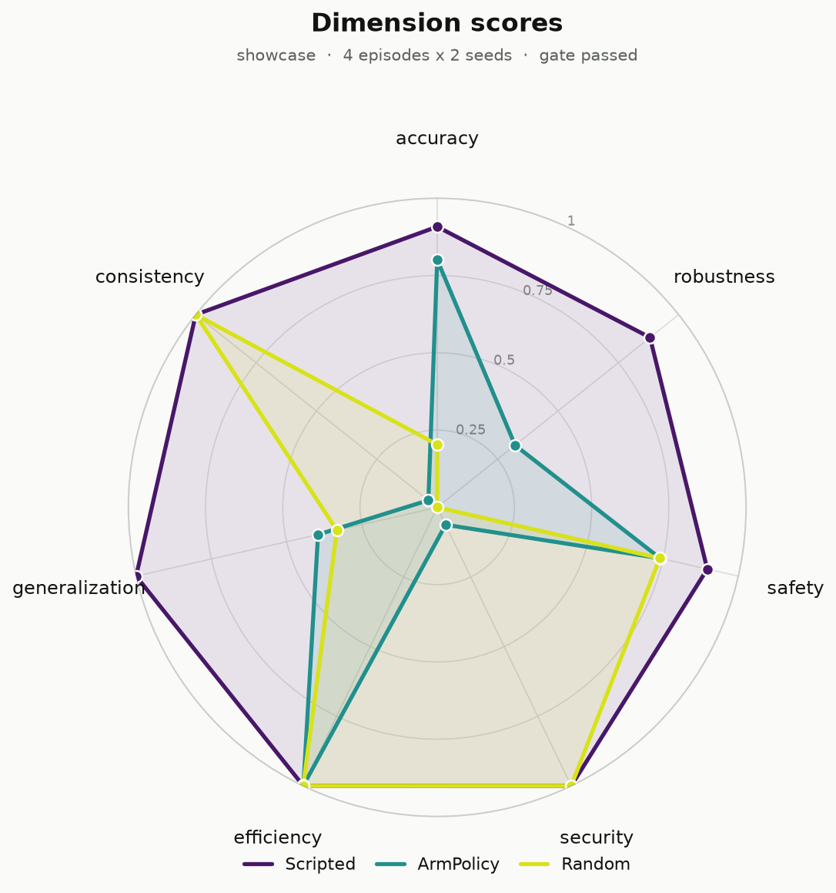
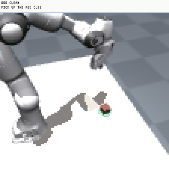
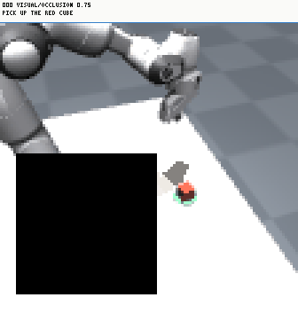
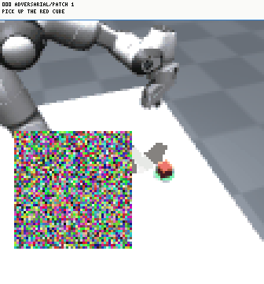

# What a run looks like

Everything on this page is the **real output** of a real run, not a screenshot of
one. The report below is the same `report.html` that `xevals.evaluate` writes; the
clips are the same GIFs; the tables are included from the same Markdown files. If
the library changes what it produces, this page changes with it.

The run is a [Franka Emika Panda](robots.md) picking a block off a table, with
three deliberately simple policies, so that the leaderboard has a top, a middle
and a floor:

| policy | what it does |
|---|---|
| `scripted` | the environment's own demonstrator, reading the simulator state |
| `visual` | finds the block by colour and back-projects it onto the table |
| `random` | uniform actions, which is the floor drawn on the chart |

```bash
python -m tools.make_example_output
```

## The leaderboard

--8<-- "assets/example/leaderboard.md"

This is the argument for the whole library, in one table, and it makes it twice.

**`scripted` and `visual` are within a tenth of a point on accuracy**, 0.91
against 0.80. They pick the same block off the same table at nearly the same
rate. Then:

- robustness `0.88` against `0.32`
- security `1.00` against `0.06`
- consistency `1.00` against `0.04`

One of them reads the simulator and is invisible to every visual perturbation;
the other looks at pixels and falls over when anything is pasted on them. A task
success rate would have called them equivalent.

**And `random` outranks `visual` on the mean**, 0.61 against 0.48, which is why
the mean is not the answer either. A policy that does nothing scores `1.00` on
security and `1.00` on consistency, because an attack cannot degrade a policy
that was never working and a policy that fails identically every time is
perfectly stable. Both numbers are true and both are useless. `visual` scores
`0.06` and `0.04` on those rows because it is actually doing the task and can
therefore be stopped from doing it.

Seven numbers, each reported with what it could not measure, is the smallest
thing that survives both of those.

{ width="520" }

!!! note "Two kinds of figure, on purpose"
    The PNG above is one of the matplotlib figures a run writes to `figures/`,
    at 200 dpi, for a paper or a slide. The charts *inside* the report are inline
    SVG instead: they follow the page into dark mode, stay sharp at any zoom,
    need no matplotlib, and cut the report from 1.4 MB to 0.4 MB.
    **Plots are for publishing; charts are for reading.**

## The report

A run writes a small set of pages in one directory, sharing a stylesheet and a
nav. They open offline, and the caveats come before the numbers on every one of
them.

| page | what is on it |
|---|---|
| [Overview](../assets/example/report.html) | status chips, the seven dimension cards, the radar, the dimension table |
| [Conditions](../assets/example/conditions.html) | every cell, the condition matrix, the severity ladders |
| [Episodes](../assets/example/episodes.html) | every episode, grouped by the condition it ran under |
| [Trade-offs](../assets/example/tradeoffs.html) | whether one dimension was bought with another |
| [Metrics](../assets/example/metrics.html) | every measurement with its interval and its `n`, plus baselines and the gate |
| [Provenance](../assets/example/provenance.html) | the fingerprint and the command that reproduces it |

<iframe src="../../assets/example/report.html" width="100%" height="680"
        style="border:1px solid var(--xevals-200); border-radius:6px; background:#FAFAF8"
        title="An xevals run report"></iframe>

[Open it full-screen](../assets/example/report.html){ .md-button }

This is the `visual` policy's report, chosen because it is the one that actually
fails somewhere. A report with no failures shows none of the machinery for
presenting them, which is most of what there is to look at: the dimension cards
with their `not measured` states, the severity ladders, the condition matrix, the
baselines and gate panel, and the trade-off verdicts.

It was one very long page until it was six. The two readers want different
things: someone deciding reads the overview, and someone checking a number goes
straight to the episode it came from, and made the second reader scroll past the
first reader's summary every time.

### The episodes page

The one to look at if a number seems wrong. Each condition gets a block carrying
its own success rate and violation rate, the clips recorded for it, and a mark
per episode it ran, in seed order.

<iframe src="../../assets/example/episodes.html" width="100%" height="680"
        style="border:1px solid var(--xevals-200); border-radius:6px; background:#FAFAF8"
        title="Every episode, grouped by condition"></iframe>

[Open it full-screen](../assets/example/episodes.html){ .md-button }

## The videos

A few episodes per cell, through the [evaluation camera](robots.md#cameras),
with a HUD carrying the step, the condition and the instruction **as the model
received it**. What you are watching is the observation, frame for frame, which
is why the occluding square and the adversarial patch are in the picture rather
than described beside it.

| clean | `occlusion@0.75` | `patch@1` |
|---|---|---|
| { width="220" } | { width="220" } | { width="220" } |
| Out over the table, down onto the block, hand shut, lift. | The square takes most of the table. This episode is one of the two in eight that still find the block on the edge of it; the other six do not. | The patch gives the colour search somewhere else to go, and the arm never reaches the block. |

Clips are **shown, not linked**. A gallery of links is a gallery nobody opens, so
a GIF animates in an `` and an mp4 plays in a `<video>`, both inline. They
stay relative rather than base64: inlining a megabyte of video per cell would
defeat the point of a directory you can zip and send.

These are GIFs because no ffmpeg was installed on the machine that generated
them. That is the documented fallback working: `save_video` returns the path it
*actually* wrote, and the page embeds that, so a missing codec produces smaller
files rather than broken images.

The attacked clip is worth watching twice. The patch is uniform noise found by
random search, not by a gradient, and it still takes the policy off the table.
A model that fails a random search has not been attacked so much as bumped into.

The occluded clip is worth watching for the opposite reason. Its cell scores
0.25: two episodes in eight still catch the block at the edge of the square, and
the other six are the policy backing the tool off to look again and finding
nothing. That is the behaviour it was written to have when it cannot see, and it
is why its safety score holds up while its accuracy collapses. A policy that
guessed when blinded would have traded those two the other way round, and the
report would show it.

## The tables

Four formats of each, from one call. JSON keeps full precision; Markdown and
LaTeX round, because rounding belongs to display and not to storage.

### Dimension scores

--8<-- "assets/example/dimensions.md"

### Every condition

--8<-- "assets/example/cells.md"

## The comparison page

A benchmark writes one more page: the leaderboard, the radar, the trade-off
verdicts, and the conditions that separate the models.

<iframe src="../../assets/example/benchmark/index.html" width="100%" height="680"
        style="border:1px solid var(--xevals-200); border-radius:6px; background:#FAFAF8"
        title="An xevals benchmark comparison"></iframe>

[Open it full-screen](../assets/example/benchmark/index.html){ .md-button }

## Reproducing it

```python
import xevals
from tools.make_example_output import Random, Scripted, environment, suite, visual_policy

bench = xevals.benchmark(
    {"scripted": Scripted(), "visual": visual_policy(), "random": Random()},
    environment, suite=suite(), episodes=4, seeds=(0, 1), record=1,
    out="runs", name="showcase",
)
```

Every artefact above comes out of that call. See
[Results schema](../concepts/results-schema.md) for what else is in the
directory, and [Benchmarks](benchmarks.md) for what the comparison adds.
