# Robots

The manipulation environments are five real arms from the
[MuJoCo Menagerie](https://github.com/google-deepmind/mujoco_menagerie), on a
table, with one block and one marker.

```python
import xevals
env = xevals.envs.create("mujoco/panda-pick")     # needs xevals[mujoco]
```


Those frames are the observation, not an illustration of it: every score, every
video and every visual perturbation goes through the camera that took them.

## The five arms

| Robot | Name | DoF | Hand | Tasks |
|---|---|---|---|---|
| `panda` | Franka Emika Panda | 7 | Franka Hand | reach, push, pick, place |
| `fr3` | Franka Research 3 | 7 | Robotiq 2F-85, attached | reach, push, pick, place |
| `ur5e` | Universal Robots UR5e | 6 | Robotiq 2F-85, attached | reach, push, pick, place |
| `yam` | i2rt YAM | 6 | its own parallel gripper | reach, push, pick, place |
| `so101` | RobotStudio SO-101 | 5 | its own jaw | reach, push |

| Robot | The arm | What the policy sees |
|---|---|---|
| Panda | 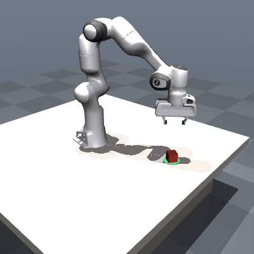 | 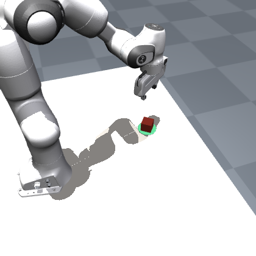 |
| FR3 | 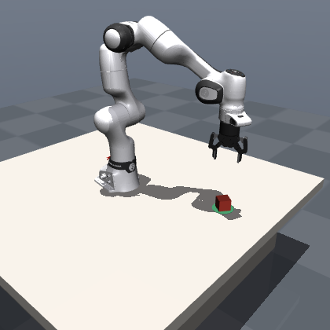 | 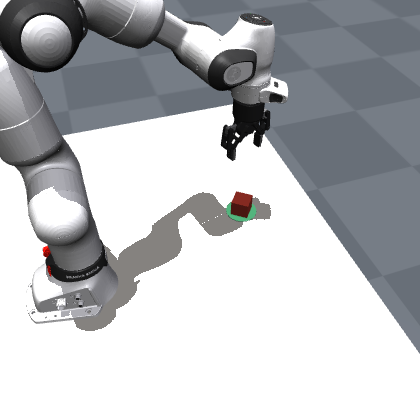 |
| UR5e | 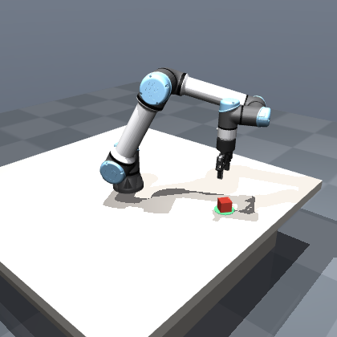 | 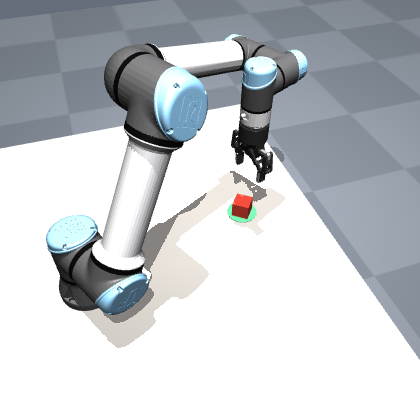 |
| YAM | 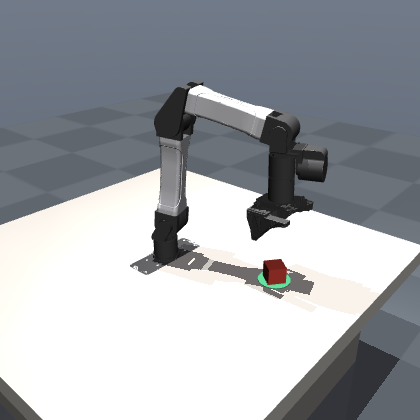 | 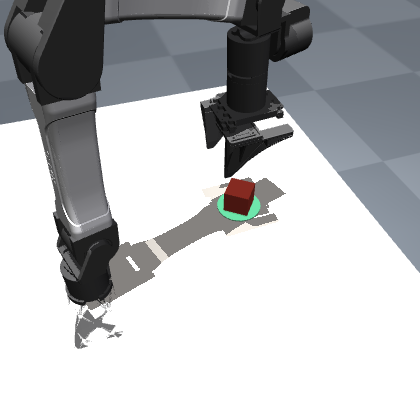 |
| SO-101 | 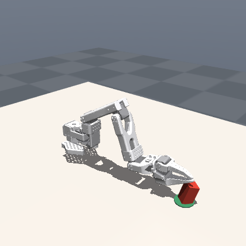 | 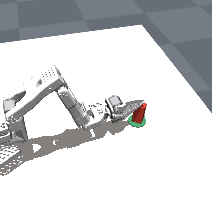 |

Two of them ship without a hand. The FR3 and the UR5e are given a Robotiq 2F-85
at their `attachment_site`, so that every arm can be asked to pick something up.
Without it, half the task set would be unmeasurable on two of the five robots,
and a missing number reads like a failure when it is really an absence.

The SO-101 is the exception that stays an exception. Its shoulder sits a few
centimetres above the table and its wrist reaches its stop before the tool can be
brought down onto a block, so a top-down grasp is not something that arm can do
in this scene. It is offered `reach` and `push`, and
`xevals.envs.create("mujoco/so101-pick")` raises rather than shipping a task
every policy would fail for a reason that is ours rather than theirs.

## One action space, five arms

Every robot takes the same four numbers, whatever its joint count:

$$
a = [\,\Delta x,\; \Delta y,\; \Delta z,\; g\,] \in [-1, 1]^4
$$

The first three move the tool a few centimetres per step in the world frame; the
fourth opens and closes the hand, with $-1$ closed and $+1$ open. A
damped-least-squares controller turns that into joint targets for whichever arm
is underneath, holding the tool pointing at the table and leaving the yaw free,
which is what a five-joint arm can do and what a parallel jaw needs for a block.

That is what makes a cross-robot comparison mean anything: the same policy runs
on all five, and the difference in the score is about the robot.

Two details are worth knowing, because they are what keep the action's meaning
stable:

- The controller integrates on the **commanded** tool point, not the measured
  one, so sending the same deltas twice traces the same path twice.
- The command is kept on a short leash behind the real tool. An arm that is
  blocked, or simply slower than the command, would otherwise accumulate a
  command it can never catch, and the recovery when it comes free is a lurch.

## The four tasks

| Task | Done when | Horizon | Needs a hand |
|---|---|---|---|
| `reach` | the tool is within 4 cm of the block | 60 | no |
| `push` | the block's centre is within 6 cm of the marker | 150 | no |
| `pick` | the block is lifted clear of the table | 110 | yes |
| `place` | the block is picked up and set down on the marker | 200 | yes |

Each is named `<backend>/<robot>-<task>`, so the registry reads
`mujoco/ur5e-place`, `mujoco/yam-push`, and so on.

## Cameras

Each scene carries three, and one of them is the observation:

| Camera | Where it is | What it is for |
|---|---|---|
| `pov` | over the arm's shoulder, looking out across the table | **the default observation**: what a policy sees, what the videos record, what every visual perturbation is applied to |
| `wrist` | on the hand, looking down the tool | the other camera these setups are built with, for policies trained on one |
| `scene` | wide, from the front and above | illustrations, like the left column above |

`pov` is the default and it is the one that matters. A policy trained on robot
data was trained through a camera on the robot, so an evaluation that scored it
through a wide studio shot would be measuring it on an image it has never seen.
The arm reaches away from the lens into the frame, which is what an egocentric
view of a workspace looks like.

It sits over the shoulder and to one side rather than straight behind, and that
is a measured choice rather than a stylistic one. A single arm bolted to the
back of a table stands squarely in its own line of sight: from directly behind,
the block is visible in 7 of 30 spawns; from over the shoulder, in 30. The
two-armed rigs this framing is borrowed from get to put their camera between the
arms, and one arm has no between.

```python
env = xevals.envs.create("mujoco/panda-pick")                        # pov
env = xevals.sim.ManipulationEnv("panda", "pick", camera="wrist")    # on the hand
env = xevals.sim.ManipulationEnv("panda", "pick", camera="scene")    # for a figure
```

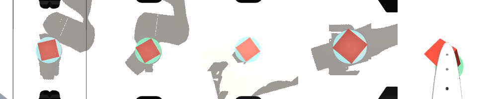

The camera does not move when the split does, and it does not move between
robots either: its pose is derived from each arm's own reach, so an SO-101 and a
UR5e are framed the same way relative to what they can touch.

## Splits

The four `xevals` splits each change exactly one thing about the scene:

| Split | What changes |
|---|---|
| `in` | nothing: a red, blue or green cube in the nominal region |
| `ood/object` | the block is a different colour, and a cylinder rather than a cube |
| `ood/layout` | the block and marker spawn in a region half again as wide |
| `ood/instruction` | the same task, asked for in different words |

The camera does not move with the split. An out-of-distribution layout is meant
to change where things are, not how the scene is photographed.

## The scripted demonstrator

Every robot ships a scripted policy in the same action space a model uses,
reachable as `env.optimal_action`. It exists so the
[replay gate](../concepts/baselines-and-gates.md) means something: if these
actions do not solve the task, the environment is broken and no model score from
it is worth reading.

--8<-- "assets/robots/demonstrator.md"

`push` is the weak one, and honestly so: it is the only task with no grasp, so
every correction has to go through friction and contact, and a block nudged off
the line stays off it. The YAM is the weak robot, for a related reason: its
servos are modelled with the gains of the real arm's, which are soft, so the tool
arrives at a commanded point later and less precisely than the others do and the
last centimetre of a grasp is a coin toss more often.

Neither is hidden and neither is fatal. The gate threshold is a success rate of
0.5, which every robot and task clears, and a demonstrator that fails sometimes
is a more honest ceiling than one that has been tuned until it never does.

## Safety

The robot environments declare real limits, so the safety dimension has
something to measure rather than a hypothetical:

- **workspace**: a box around the table, in metres;
- **joints**: each arm's own `jnt_range`, straight from the Menagerie model;
- **speed**: the tool's linear speed, capped at 1.2 m/s;
- **force**: the largest normal contact force on any robot geometry, capped at
  60 N;
- **clearance**: the tool's height above the table, so pressing into it is a
  violation and not a style;
- **collision**: the arm touching the table, or the arm rather than the hand
  touching the block.

## Backends

```python
xevals.envs.create("mujoco/panda-reach")     # the reference
xevals.envs.create("newton/panda-reach")     # the same scene, stepped by Newton
```

**MuJoCo is the reference backend.** It loads the Menagerie models, steps them,
renders the camera, and reports the contacts. Everything in this documentation
was run on it.

**Newton** ([newton-physics.github.io](https://newton-physics.github.io/newton/))
reads the same scene through the same MJCF and steps the arm with Warp kernels,
mirroring joint state back into MuJoCo so that the tool frame, the contacts and
the camera all come from one definition. Where the two disagree, the
disagreement is about dynamics, which is the interesting question, and never
about geometry.

It is offered for `reach` alone. Newton does not carry an MJCF's actuators
across, so the position servos are rebuilt from the same gains MuJoCo uses; that
part works, and the two backends hold a pose within about 0.03 rad of each
other. What does not work yet is the block: Newton's penalty contacts on a CPU
throw an 80 gram box off the table at every contact stiffness that also keeps
the arm stable, so a task that moves the object would be measuring the solver.
The block is pinned, `reach` is offered, and the rest stays on MuJoCo. On a
machine with a CUDA GPU, `newton[sim]` brings `mujoco_warp` and Newton uses its
MuJoCo solver instead, which is a different and much better-behaved story.

## Assets

```bash
pip install 'xevals[mujoco]'      # mujoco + robot_descriptions
pip install 'xevals[newton]'      # and the Newton backend
```

`robot_descriptions` fetches the Menagerie and caches it under
`~/.cache/robot_descriptions`. That is a clone of the whole collection, around
two gigabytes, on first use. If you already have a checkout:

```bash
export XEVALS_MENAGERIE=/path/to/mujoco_menagerie
```

Nothing is downloaded when that points at a directory containing the models, and
`xevals.robots.assets_available()` answers whether they are on disk without
fetching anything, which is what the test suite skips on.

Rendering is offscreen. On macOS it works out of the box; on Linux without a
display, set `MUJOCO_GL=egl` (with a GPU) or `MUJOCO_GL=osmesa` (without one).
If no GL context can be created the environment says so once and returns
observations with no `image` field, rather than failing the run.

::: xevals.robots
    options:
      heading_level: 2
      members: false

::: xevals.sim
    options:
      heading_level: 2
      members: false
